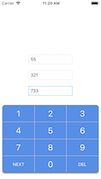

# NumberPad
A NumberPad input view.  Not a keyboard, but it works kind of like one.
The NumberPad is a UIViewController.  It can be added to a UIViewController as a childVC with any frame and position.

## Installation
Copy the contents of the Source folder into your project - `NumberPadInputViewController.swift` & `NumberPadInputViewController.xib`

## Usage
See the example project for details on how to implement.

In the simplest form, add `NumberPadInputViewController` as a property on your UIViewController and add it as a child view controller:

    var numPad = NumberPadInputViewController()
    
    override func viewDidAppear(_ animated: Bool) {
        super.viewDidAppear(animated)
        numPad = NumberPadInputViewController(nibName: "NumberPadInputViewController", bundle: nil)
        numPad.delegate = self
        numPad.view.frame = CGRect(x: 0, y: 0, width: 400, height: 300)
        view.addSubview(numPad.view)
        numPad.didMove(toParentViewController: self)
    }
    
    // Conform to the NumberPadDelegate
    func numberPad(_ numberPad: NumberPadInputViewController, typed number: String) { }
    func tappedNext(numberPad: NumberPadInputViewController) { }
    
The input to NumberPadInputViewController will be sent to the delegate where it can be handled accordingly.  Again, see the example project for how input can be routed to the appropriate UITextField.

## Customization
There is support for several customization options:
* cornerRadius
* Custom Button Titles
* Button color
* Button font color
* Button font
* Differing font for specified button positions (`NEXT` and `DEL` in the screenshot)
* Button border color - the border between the buttons
* Outside border color - the border of the entire NumberPad
